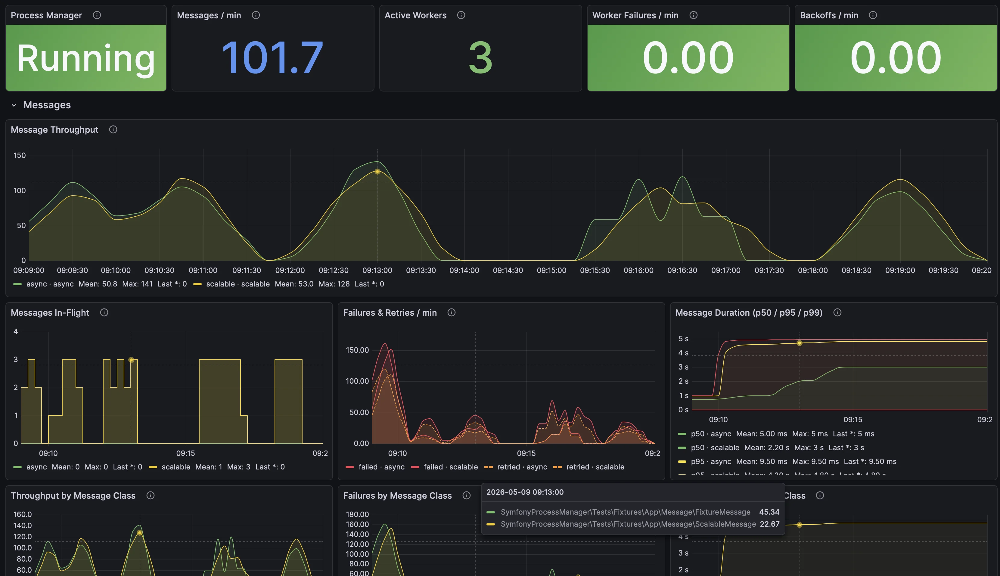
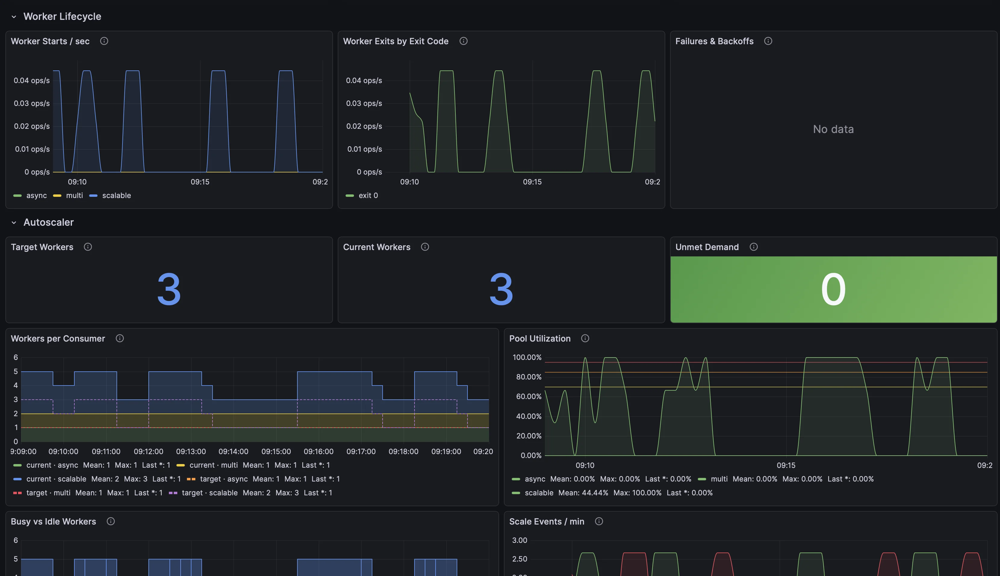

# Symfony Process Manager

> [!CAUTION]
> Heavy work in progress. Pre-1.0 — may introduce large BC breaks any time. Pin to exact version and review changelog before upgrading until `1.0` lands.

Symfony bundle that runs and supervises Symfony Messenger workers as subprocesses.

`pm:serve` starts an event loop that:

- spawns `messenger:consume` processes per configured **consumer** (each consumer reads one or more transports)
- restarts workers on exit (immediate restart for exit code 0, exponential backoff for non-zero exits)
- shuts down gracefully on SIGTERM
- exposes a small HTTP server for health and Prometheus metrics

## Requirements

- PHP 8.5+
- Symfony 7.4+

## Installation

```bash
composer require robotomarvin/symfony-process-manager
```

Enable the bundle (if not using a Symfony Flex recipe):

```php
// config/bundles.php

return [
    // ...
    SymfonyProcessManager\SymfonyProcessManagerBundle::class => ['all' => true],
];
```

## Configuration

Create `config/packages/symfony_process_manager.yaml`:

```yaml
symfony_process_manager:
  shutdown_timeout: 30
  total_cap: null                # optional global ceiling on total workers
  autoscaler_interval_sec: 10    # how often the autoscaler evaluates strategies

  http_server:
    host: 127.0.0.1
    port: 9100

  metrics:
    messages:
      enabled: true
      whitelist: []
      duration_buckets: [0.01, 0.05, 0.1, 0.5, 1, 5, 10, 30, 60]

  consumers:
    async:
      # Static, single-transport consumer (scalar form)
      transports: async
      processes: 2
      failure_limit: 3
      failure_window: 60
      backoff_base: 1
      backoff_max: 30
      poll_interval_ms: 200
      consume_args:
        memory_limit: 128
        time_limit: 300
        limit: null
        sleep: null
        queues: []
        extra: []
    ingest:
      # Multi-transport consumer: one process consumes both transports.
      # Messenger polls them in list order — `orders` drains before
      # `payments` gets attention. List order = priority.
      transports: [orders, payments]
      processes: 2
    priority:
      # Autoscaled consumer
      transports: priority
      autoscaler:
        min: 1
        max: 5
        priority: 10
        smoothing_window_sec: 30
        scale_up_cooldown_sec: 30
        scale_down_cooldown_sec: 300
        scale_up_step: 2
        scale_down_step: 1
        strategy:
          type: utilization        # 'fixed' | 'utilization' | 'service'
          target: 0.7
      consume_args:
        queues: ['priority']
```

### Top-Level Options

- `shutdown_timeout` (int seconds, default 30) — after SIGTERM is sent to workers, wait this many seconds before escalating to SIGKILL. Set to `0` to wait indefinitely.
- `total_cap` (int|null, default null) — optional global ceiling on the sum of workers across all pools. When set, a `PriorityArbiter` shares the cap across pools by priority.
- `autoscaler_interval_sec` (int seconds, default 10) — how often the autoscaler evaluates strategies and adjusts pool targets.
- `http_server.host` (string, default `127.0.0.1`) — interface the health/metrics HTTP server binds to.
- `http_server.port` (int, default `9100`) — port the health/metrics HTTP server listens on.

### Metrics Options

- `metrics.messages.enabled` (bool, default `true`) — when `false`, no `messenger_*` metrics are emitted and the in-worker subscriber is not registered (zero runtime cost).
- `metrics.messages.whitelist` (list, default `[]`) — controls cardinality of the `message_class` label.
  - Empty: every FQCN is its own label value.
  - Otherwise each entry is either an exact FQCN or a glob (`*` / `?` resolved with `fnmatch`); message classes that match nothing are bucketed under `message_class="other"`.
- `metrics.messages.duration_buckets` (list of floats, default `[0.01, 0.05, 0.1, 0.5, 1, 5, 10, 30, 60]`) — histogram bucket bounds in seconds. Sorted and deduped on load; `+Inf` is appended automatically by the renderer.

### Consumer Options

Each entry under `consumers` configures one pool of `messenger:consume <transports...>` worker processes. A consumer must use **either** `processes` (static) **or** `autoscaler` (dynamic) — never both.

- `transports` (string | list<string>, required) — one or more Symfony Messenger transport names this consumer reads from. A scalar is normalized to a one-element list (`transports: failed` ≡ `transports: [failed]`). Multi-transport consumers run a single PHP process per worker that polls all listed transports (`bin/console messenger:consume t1 t2 ...`). **List order is priority order**: Messenger polls transports in the order given and picks the first available message, so `t1` is fully drained before `t2` gets a turn — useful for primary/fallback (e.g. `[main, failed]`), not for fair sharing. If you need fair sharing, give each transport its own consumer. All other consumer fields apply to the whole pool — `consume_args` cannot vary per transport.

Static pool options:

- `processes` (int, default 1)
- `failure_limit` (int, default 3)
- `failure_window` (int seconds, default 60)
- `backoff_base` (int seconds, default 1)
- `backoff_max` (int seconds, default 30)
- `poll_interval_ms` (int milliseconds, default 200)
- `consume_args`
  - `memory_limit` (int|null)
  - `time_limit` (int|null)
  - `limit` (int|null)
  - `sleep` (int|null)
  - `queues` (list<string>)
  - `extra` (list<string>) additional CLI flags

### Autoscaler Options

`consumers.<label>.autoscaler` enables dynamic worker scaling for that pool.

- `min` (int, required) — lower bound; autoscaled pools start at this count
- `max` (int, required) — upper bound
- `priority` (int, default 0) — higher priorities are preferred under `total_cap` contention
- `smoothing_window_sec` (int, default 30) — EWMA time constant for `busy`/`idle`/`throughput` signals
- `scale_up_cooldown_sec` (int, default 30) — minimum seconds between successive scale-ups
- `scale_down_cooldown_sec` (int, default 300) — minimum seconds between successive scale-downs
- `scale_up_step` (int, default 2) — maximum workers added per evaluation
- `scale_down_step` (int, default 1) — maximum workers removed per evaluation
- `strategy.type` — one of:
  - `fixed` — always returns `min` workers (effectively pins the pool)
  - `utilization` — scales by busy-worker ratio. Configure with either:
    - `target` (float, default `0.7`) — single setpoint; returns `ceil(busy / target)`
    - `scale_up_threshold` + `scale_down_threshold` (floats, 0.0–1.0; `down` ≤ `up`) — deadband mode. Scale up when utilization > `scale_up_threshold`, down when < `scale_down_threshold`, hold otherwise. Prevents flapping at steady-state.
  - `service` — `strategy.id` (string, required) references a service implementing `SymfonyProcessManager\Autoscaler\Strategy\ScalingStrategyInterface`

## Usage

```bash
php bin/console pm:serve
```

Starts the HTTP server and begins supervising worker processes.

## HTTP Endpoints

- `GET /` returns `{"status":"ok"}`
- `GET /metrics` returns Prometheus text format

## Monitoring Dashboard

A ready-to-import **Symfony Process Manager** Grafana dashboard ships with the bundle. Panels cover process health, message throughput, worker lifecycle, and autoscaler decisions.





Import it via **Dashboards → New → Import** in your Grafana, using [`docker/grafana/provisioning/dashboards/process-manager.json`](docker/grafana/provisioning/dashboards/process-manager.json). Point its Prometheus datasource at the instance scraping `pm:serve`'s `/metrics` endpoint.

## Output Behavior

Worker output is forwarded to the parent process stdout/stderr.

- JSON log lines are enriched with `extra.worker_id` and `extra.consumer`.
- Non-JSON lines are prefixed with `[worker N <consumer>]`.

## Metrics

The `/metrics` endpoint exposes Prometheus metrics including:

Process manager:

- `process_manager_running` (gauge)
- `worker_starts_total{consumer=...}` (counter) — process-level event, no transport label
- `worker_exits_total{consumer=...,exit_code=...}` (counter)
- `worker_failures_total{consumer=...}` (counter) — process-level; for transport-level failures see `messenger_messages_failed_total`
- `worker_backoffs_total{consumer=...}` (counter) — process-level
- `worker_sigkills_total` (counter)
- `messages_processed_total{consumer=...,transport=...}` (counter) — labelled with the real transport reported by the worker (no fan-out)
- `worker_last_pong_timestamp{worker=...}` (gauge) — cleared on worker exit
- `worker_busy{worker=...,consumer=...,transport=...}` (gauge, 0/1) — cleared on worker exit; `transport` is the transport reported by the IPC message

Messenger messages (gated by `metrics.messages.enabled`):

- `messenger_messages_processed_total{transport, message_class}` (counter)
- `messenger_messages_failed_total{transport, message_class}` (counter)
- `messenger_messages_retried_total{transport, message_class}` (counter)
- `messenger_message_duration_seconds{transport, message_class}` (histogram, observed on `handled` and `failed`)
- `messenger_messages_in_flight{transport}` (gauge, incremented on `received`, decremented on `handled`/`failed`)

Autoscaler (pool-level — one entry per consumer):

- `autoscaler_target_workers{consumer=...}` (gauge) — last decision after the stability layer
- `autoscaler_current_workers{consumer=...}` (gauge) — active worker count, excluding draining
- `autoscaler_unmet_demand{consumer=...}` (gauge) — `desired - allocated` after arbitration
- `autoscaler_scale_up_total{consumer=...}` (counter)
- `autoscaler_scale_down_total{consumer=...}` (counter)
- `autoscaler_decisions_skipped_total{consumer=...,reason=...}` (counter) — reasons: `cooldown_up`, `cooldown_down`, `step_cap`, `at_min`, `at_max`
- `worker_busy_workers{consumer=...}` (gauge)

## Upgrading

### Breaking: `transports:` renamed to `consumers:`

Pre-1.0 breaking change. The root config key `transports:` became `consumers:`, and each consumer must declare its `transports:` field explicitly (scalar or list). There is no backward-compatibility shim — old config will fail validation with `Unrecognized option "transports" under "symfony_process_manager"`.

Before:

```yaml
symfony_process_manager:
  transports:
    failed:
      processes: 1
    async:
      processes: 2
```

After:

```yaml
symfony_process_manager:
  consumers:
    failed:
      transports: failed       # scalar shorthand
      processes: 1
    async:
      transports: [async]      # list form is also valid
      processes: 2
```

Multi-transport consumers (one process consumes several transports in list order — earlier transports have priority and drain before later ones get a turn) become possible:

```yaml
consumers:
  ingest:
    transports: [orders, payments]
    processes: 2
```

Metric and log label changes that ship with the rename:

- All `{transport=...}` labels on supervisor and autoscaler metrics are now `{consumer=...}` (pool-level) or `{consumer=...,transport=...}` (per-transport, fanned across the consumer's transports).
- `messages_processed_total{consumer,transport}` uses the real transport the worker reported via IPC, not the consumer label.
- `worker_busy{worker,consumer,transport}` is now keyed by IPC-reported transport.
- Non-JSON worker log lines are now prefixed `[worker N consumer-label]` (was `[worker N]`).
- JSON log lines now carry both `extra.worker_id` and `extra.consumer`.

## Specifications

Deeper docs for runtime behavior, IPC, autoscaler internals, and metrics live in [`spec/`](spec/README.md).

## Development

See [`CONTRIBUTING.md`](CONTRIBUTING.md) for the Docker toolchain, quality gates, demo traffic scenarios, and code/testing rules.

## License

MIT
